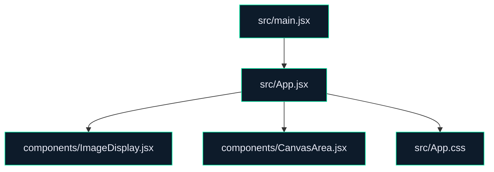

# Image Mask Drawing Tool

The Image Mask Drawing Tool is a user-friendly web application that allows you to upload images and create masks using a drawing tool. This tool is perfect for non-technical users who want to easily manipulate images by drawing on them and exporting the mask for further use.

## Features

- **Image Upload**: Easily upload JPEG or PNG images from your device.
- **Interactive Canvas**: Use a simple drawing tool to create masks over uploaded images.
- **Brush Size Control**: Adjust the brush size to suit your masking needs.
- **Mask Export**: Export your drawn mask for use in other applications.
- **Image Display**: View the original and masked images side by side.

## Tech Stack

This project is built using the following technologies:

- **React**: A JavaScript library for building user interfaces.
- **Axios**: A promise-based HTTP client for making requests.
- **Fabric.js**: A powerful and flexible JavaScript canvas library.
- **React Canvas Draw**: A simple yet customizable React component for drawing on the canvas.
- **Tailwind CSS**: A utility-first CSS framework for styling the application.
- **Vite**: A build tool that provides a fast and optimized development experience.

## Installation

Prerequisites: Ensure you have Node.js (>= 14.x) and npm (>= 6.x) installed on your system.

1. Clone the repository:

   ```bash
   git clone https://github.com/ArifRahaman/frontend_msk.git
   cd frontend_msk
   ```

2. Install dependencies:

   ```bash
   npm install
   ```

3. Start the development server:

   ```bash
   npm run dev
   ```

   The application will be available at `http://localhost:3000`.

## Usage Guide

1. **Upload an Image**: Click on the upload section to select an image or drag and drop an image file.
2. **Draw a Mask**: Use the interactive canvas to draw a mask over your image. Adjust the brush size as needed.
3. **Export the Mask**: Once you're satisfied with your drawing, export the mask for use in other applications.
4. **View Images**: Compare the original and masked images side by side.

## Environment Variables

There are no specific environment variables required for this application. All configurations are handled internally.

## API Reference

- **POST /upload**: Uploads the original image and the drawn mask to the server. This endpoint requires a multipart/form-data request containing the fields `original` and `mask`.

## Architecture



## Contributing

We welcome contributions from the community. If you wish to contribute, please fork the repository and submit a pull request with your changes.

## License

This project is licensed under the MIT License. You are free to use, modify, and distribute this software in accordance with the terms of the license.

## Image Mask Drawing Tool

This section details the core functionality of the Image Mask Drawing Tool, including its image upload, canvas drawing capabilities, and mask export features. The tool utilizes React for UI components, with axios handling HTTP requests, and Tailwind CSS for styling. The application architecture emphasizes modularity and scalability, with a clean separation of UI and logic components.

---
> 🤖 *Last automated update: 2026-03-26 01:20:23*